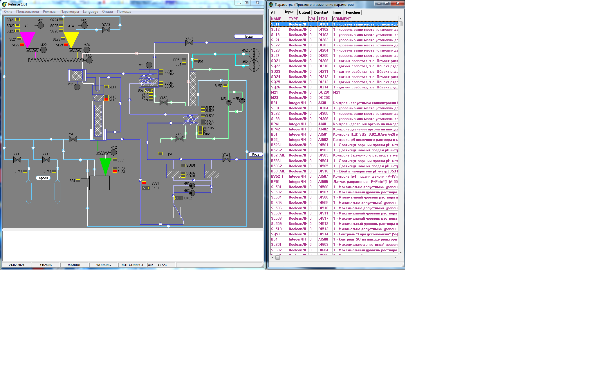

# SCADA Система для Управления Производственной Линией (СУПЛ)

 

---
## Описание проекта

SCADA Система для Управления Производственной Линией (СУПЛ) представляет собой программное решение, разработанное для автоматизации и управления производственной линией по производству литий-ионных аккумуляторов. Этот проект, написанный на языке программирования Delphi, позволяет эффективно управлять производственными процессами с высокой гибкостью и надежностью.

Проект обеспечивает гибкую настройку датчиков и типов датчиков с коэффициентами конвертирования, а также управление различными устройствами и механизмами. Пользователи могут выбирать между режимами автоматического и ручного управления в зависимости от текущих потребностей и предпочтений. Важной функцией является ведение логов работы программы и показаний датчиков, а также обработка исключительных ситуаций. Проект предоставляет возможность гибкой настройки отображения установки с выводом графического представления работы датчиков и механизмов. 

---

## Основные функции

- **Гибкая настройка устройств:** Позволяет настраивать различные типы датчиков и устройств, а также их коэффициенты конвертирования, с учетом специфики производственных процессов.

- **Управление производственной линией:** Обеспечивает полный контроль и управление механизмами и оборудованием производственной линии, включая режимы автоматического и ручного управления.

- **Ведение журналов работы:** Автоматически ведет подробные журналы работы и показаний датчиков для обеспечения прозрачности и анализа производственных данных.

- **Графическое отображение данных:** Предоставляет интуитивно понятное графическое отображение работы оборудования и датчиков для наглядного мониторинга процессов.

- **Мультиязычность:** Поддерживает несколько языков интерфейса для удобства использования пользователей из различных культурных сред.

---

## Дополнительные возможности

- **Обработка исключительных ситуаций:** Встроенный механизм обработки исключительных ситуаций для быстрого реагирования на непредвиденные события.

- **Надежность работы:** Использует механизмы мониторинга и перезапуска процессов для обеспечения надежности работы системы.
